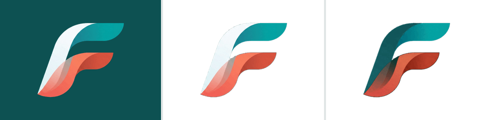
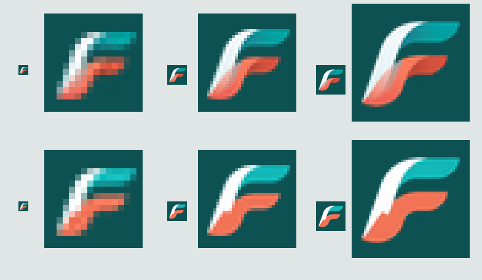
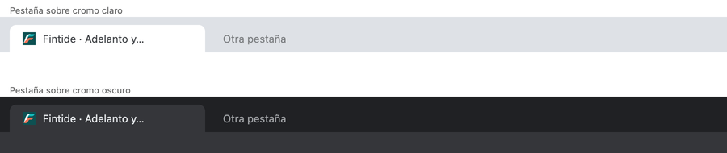

# El símbolo de marca

> Este documento nació como `docs/MARCA-SIMBOLO.md` en el monorepo `Fintide`
> y desde el 29 de septiembre de 2026 vive aquí, con las rutas de este
> repositorio. Lo que dice de dónde aparece el símbolo en el producto
> (cabeceras, barra lateral, acceso) describe el monorepo.
>
> Desde esa fecha los iconos con baldosa se componen en enteros en vez de
> con libvips, para que salgan iguales en cualquier computadora (ver
> `baldosa()` en `scripts/generar-simbolo.mjs`). Cambiaron unos niveles en
> los bordes; a la vista, iguales.

## 1. El fondo estaba horneado

El original trae el símbolo sobre un verde sólido —`rgb(20, 82, 92)`, medido
sobre el marco—, así que solo funcionaba sobre ese verde exacto. Sobre cualquier
otro color aparecía un cuadrado.

El fondo es plano, así que el alfa sale de la distancia al color de fondo. Lo
que de verdad importa no es la máscara sino lo que viene después: cada pixel del
borde es `a·tinta + (1−a)·fondo`, y **despejar la tinta** es lo que evita el
halo verde que queda al recortar sin más. Sin ese paso el símbolo se puede poner
sobre blanco, pero lleva un contorno sucio que se nota justo en las curvas
largas, que aquí son casi todo el dibujo.

La separación es limpia: ningún pixel del símbolo baja de 60 de distancia al
fondo, y el borde con transparencia parcial ocupa menos de 4.000 pixeles de un
millón. La rampa del alfa va de 12 a 48 y no toca nada del interior.

## 2. La cinta blanca desaparecía sobre fondo claro

Es la que da la forma a la F. Sobre blanco quedaba una F coral incompleta
flotando, sin espina.

De izquierda a derecha: el símbolo recortado sobre el verde de marca; el mismo
archivo sobre blanco, donde se pierde la espina y la F deja de leerse; y la
variante para fondo claro.

La variante **no pinta encima**: cambia la tinta. La cinta blanca aporta luz sin
croma, así que se puede estimar cuánta cubre cada pixel y aplicar
`nuevo = obs + w·s·(oscuro − blanco)`, que da exactamente el mismo resultado que
habría salido de componer la ilustración con la cinta ya en verde azulado
profundo. La ventaja es que los cruces translúcidos con el coral se oscurecen
solos, en la proporción que les toca, y no hay que inventarse un color para
ellos.

Comprobado sobre blanco y sobre `slate-50`, que son los dos fondos claros del
producto: la espina en `#0D5152` sostiene la forma y el brazo coral sigue
leyéndose como el brazo de la F.

## 3. A tamaño diminuto el cruce era una mancha

El cruce del coral con la blanca produce un rosa apagado. Reducido a 16 px, ese
rosa se come el contraste entre las dos cintas y el símbolo pierde la forma.

Arriba el símbolo encogido tal cual; abajo la versión aplanada. Cada tamaño se
muestra real y ampliado, que es la única forma honesta de juzgar esto.

**El favicon no es el logotipo encogido.** Para 48 px y menos, cada pixel se
lleva a la tinta plana más cercana de las tres de la marca antes de reducir. No
es un dibujo nuevo: es el mismo símbolo, la misma silueta y los mismos colores,
sin la mezcla translúcida que a esa medida no se puede resolver. Es práctica
normal y aquí la diferencia entre leerse y no leerse.

De 96 px en adelante —el icono de iOS, el de Android— va la versión fiel, con
sus degradados y su cruce, porque a esa medida se resuelve sin problema.

El símbolo va sobre baldosa verde azulada en todos los iconos. En la pestaña la
cinta blanca necesita un fondo propio: sobre el cromo claro de un navegador
desaparecería igual que desaparecía sobre blanco.

## Las piezas

| Archivo | Medida | Peso | Para qué |
| --- | --- | --- | --- |
| `simbolo/simbolo.png` | 295×256 | 20.0 kB | Maestro transparente, cinta blanca. Fondos oscuros. |
| `simbolo/simbolo-fondo-claro.png` | 295×256 | 20.9 kB | Cinta en verde azulado. Fondos claros. |
| `iconos/favicon.ico` | 16, 32, 48 | 3.5 kB | Pestaña. Versión aplanada. |
| `iconos/icon-32.png` | 32×32 | 1.2 kB | `rel="icon"` moderno. Aplanada. |
| `iconos/apple-icon-180.png` | 180×180 | 5.3 kB | Pantalla de inicio de iOS. |
| `iconos/icono-192.png` | 192×192 | 5.7 kB | Manifiesto. |
| `iconos/icono-512.png` | 512×512 | 27.1 kB | Manifiesto. |
| `iconos/icono-maskable-512.png` | 512×512 | 14.0 kB | Manifiesto, recorte de Android. |

En el monorepo, los nombres de `app/` no son decorativos: `favicon.ico`, `icon.png`,
`apple-icon.png` y `manifest.ts` son convenciones de Next, que genera las
etiquetas `<link>` sola. No hay ninguna etiqueta de icono escrita a mano.

**El símbolo transparente y la versión para fondo oscuro son el mismo archivo.**
El original está pensado para ese verde y el recorte fiel ya es la pieza que
funciona sobre superficie oscura; una tercera copia idéntica solo sería una
segunda cosa que mantener sincronizada.

Los dos maestros van a 256 px de alto y los sirve `next/image`, que entrega al
navegador la medida exacta que se pide —uno o dos kilobytes en una cabecera—.
Esos 20 kB se quedan en el servidor.

## El logotipo, y el salto de tipografía

El nombre iba en texto con `next/font` y `display: swap`. Para el cuerpo del
texto es la decisión correcta, porque se lee desde el primer instante; para un
logotipo no, porque durante los primeros momentos de la primera visita se pinta
con la tipografía del sistema y luego salta. Es justo el instante en que alguien
ve la marca por primera vez.

En `components/marca/logotipo.tsx` el nombre son **curvas**, no texto: las
mismas letras, de la misma tipografía (Plus Jakarta Sans SemiBold), en el mismo
peso y con el mismo interletraje (`tracking-tight`, −0.025 em), convertidas a
trazo desde `tipografia/jakarta-600.woff` —el mismo
archivo con el que se componen las tarjetas sociales—. Se pinta idéntico desde
el primer cuadro y ya no depende de que cargue ninguna fuente. Hereda el color
con `currentColor`, así que la misma pieza sirve en blanco sobre la cabecera y
en verde azulado sobre la pantalla de acceso.

El símbolo sí es un mapa de bits, y a propósito: tiene degradados y dos cintas
que se cruzan translúcidas. Un trazado vectorial de eso no sería el mismo
símbolo, sería una versión parecida.

### El punto coral

Había un punto coral tras el nombre y se ha retirado en los cinco sitios donde
estaba. Era el único elemento de marca mientras no hubo símbolo, y ese trabajo
ya lo hace el símbolo. Con los dos, el coral aparece dos veces en cuatro
centímetros: el acento deja de señalar y pasa a ser decoración repetida.

## Dónde aparece

Cabecera y pie de los dos sitios públicos, barra lateral del back office y del
portal (en escritorio y en el encabezado móvil), y las dos pantallas de acceso
—en la columna oscura con la cinta blanca, y en móvil, donde esa columna
desaparece, con la variante de cinta oscura—.

El recorrido guiado no lleva marca propia: son tarjetas ancladas a la pantalla
que explican, y una de ellas apunta al menú, que ya muestra el logotipo nuevo.

Las diez tarjetas sociales lo llevan arriba a la izquierda. No hubo que
regenerar ninguna imagen: se hicieron con la marca en una capa de texto aparte
justamente para esto, así que bastó con añadir el logotipo a
`scripts/componer-tarjetas-sociales.mjs` y volver a componer. Ahí el nombre sí
es texto y no curvas, porque se compone una vez en un servidor con la fuente ya
cargada y el motivo para vectorizarlo no existe.

## Lo que se retiró

- `apps/web/public/favicon.ico`: un ICO de 16 px de julio, sin seguir. Convivía
  con `app/favicon.ico`, que es el que Next sirve de verdad.
- `apps/web/public/marca/logos/`: doce archivos sin seguimiento con
  exploraciones anteriores —otra F, una ola, dos versiones horizontales—. Son
  alternativas de una decisión que ya está cerrada, y estaban dentro de la
  carpeta que el sitio publica, que es el único sitio donde podían hacer daño.
